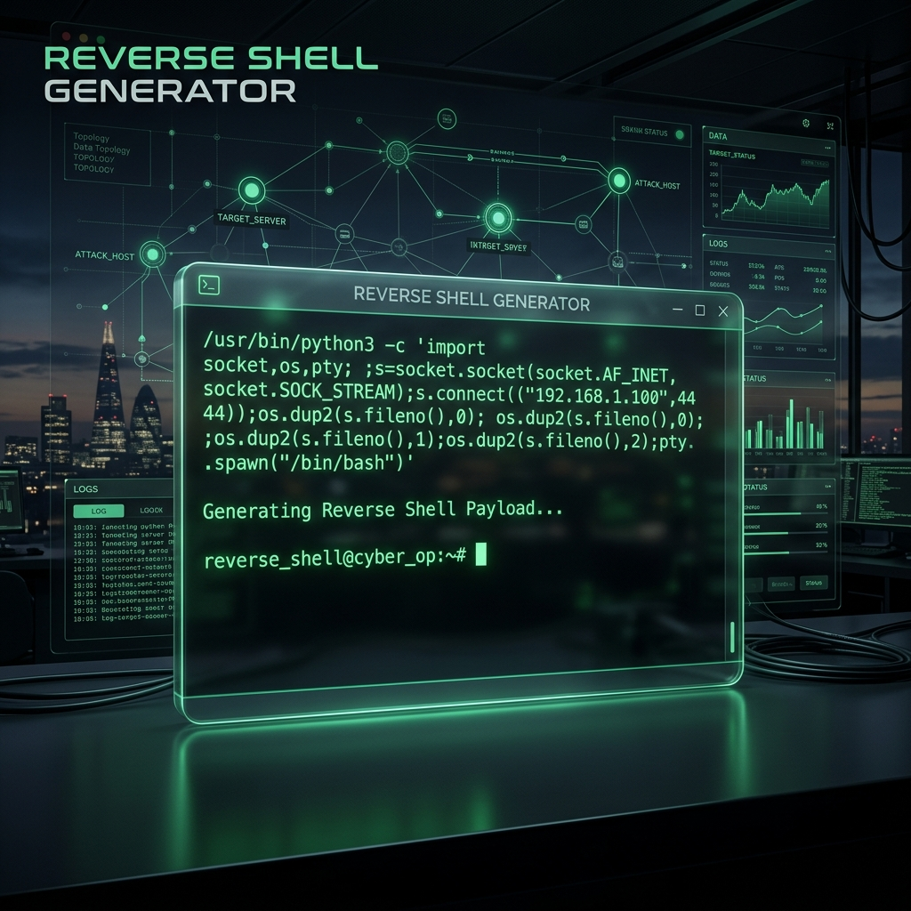

# ☠️ Reverse Shell Generator PRO



[](LICENSE)
[](https://github.com/geevarghesekthomas84-sys/reverse-shell-generator/stargazers)
[](https://geevarghesekthomas84-sys.github.io/reverse-shell-generator/)

**A premium, enterprise-grade Command & Control (C2) payload generator designed for Red Team operators and Penetration Testers.**

---

## 💎 Premium Design & Features

- ⚡ **Next-Gen Glassmorphic UI** — A stunning, ultra-modern interface built with a deep-sea slate and emerald palette.
- 📂 **Smart Categorization** — Sidebar navigation for Linux, Windows, Web, Listeners, and Shell Upgrades.
- 🔍 **Live Search & Filter** — Instantly find the exact payload you need with real-time fuzzy search.
- 🔐 **Advanced Encoding** — Supports Base64, URL Encoding, and specialized PowerShell `-EncodedCommand` generation.
- 📋 **Intelligent One-Click Copy** — Instant feedback system with clipboard notification.
- 📱 **Fully Responsive Architecture** — Seamlessly transitions between desktop C2 workstation and mobile field deployment.
- 🚀 **Zero Dependencies** — High-performance single-file architecture (HTML/CSS/JS) with no external frameworks.

---

## 🛠️ Supported Platforms & Payloads

| Platform | Variants | Capabilities |
|----------|----------|--------------|
| **Linux / Unix** | Bash, Netcat, Python, Perl, Ruby, Socat | TCP, FIFO, PTY, TTY |
| **Windows** | PowerShell, CMD | Base64, EncodedCommand, IEX |
| **Web / Script** | PHP, Python3, Perl | exec, proc_open, popen |
| **Listeners** | nc, rlwrap, msfconsole | Local Handler Configuration |
| **Upgrades** | Python PTY, script | Full TTY Stabilization |

---

## 🚀 Deployment

### Online
Access the production deployment: [https://geevarghesekthomas84-sys.github.io/reverse-shell-generator/](https://geevarghesekthomas84-sys.github.io/reverse-shell-generator/)

### Local Development
```bash
# Clone the repository
git clone https://github.com/geevarghesekthomas84-sys/reverse-shell-generator.git

# Launch the interface
open index.html
```

---

## ⚠️ Disclaimer

This tool is for **authorized security auditing and educational purposes only**. Unauthorized access to computer systems is strictly prohibited and punishable by law.

---

## 🤝 Support & Contribution

If this tool has streamlined your operations, **consider giving it a star!** Contributions to payload logic and UI refinements are always welcome.

---

<div align="center">
  <b>Built with 🛡️ by GG</b>
</div>
